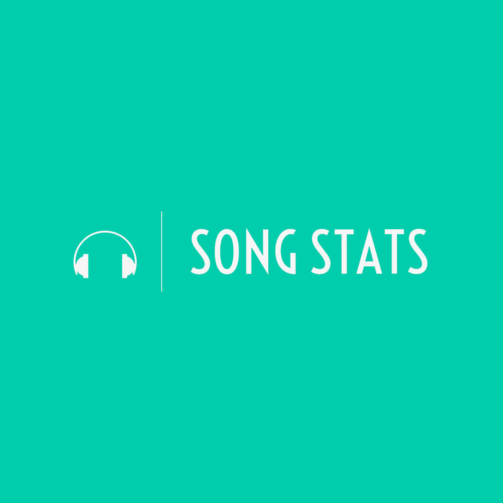
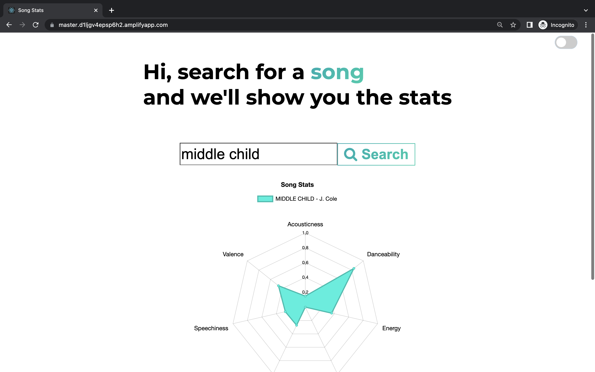

<div align="center">

 <br />

# Song-stats


[Overview](#scroll-overview)
•
[Screenshot](#rice_scene-screenshot)
•
[URL](#computer-url)
•
<!-- [Blogpost](https://medium.com/@blusse7/deploying-a-chatbot-on-heroku-using-flask-and-huggingface-7dadb77d8f48) -->
</div>

## :bookmark_tabs: Menu

- [Overview](#scroll-overview)
- [Screenshot](#rice_scene-screenshot)
- [URL](#computer-url)
- [Requirements](#exclamation-requirements)
- [Folder Structure](#open_file_folder-folder-structure)
- [Author](#smiley_cat-author)

## :scroll: Overview

This web app serves as an interface to find musical statistics of songs. The web app uses the Spotify API to fetch songs and their statistics and serves this through a radar chart. Hovering over the different statistics gives more information about their meaning. 

## :rice_scene: Screenshot



## :computer: URL

https://master.d1ljgv4epsp6h2.amplifyapp.com/

## :exclamation: Requirements

- [React](https://reactjs.org/)
- [Spotify API](https://developer.spotify.com/documentation/web-api/)

## :open_file_folder: Folder Structure

```
.
├── package.json
├── package-lock.json
├── src                 # Folder with all web elements
│   ├── components
│   ├── context
│   ├── style
│   ├── typography
│   ├── utils
│   ├── App.js
│   └── index.js
├── public
│   ├── index.html              
│   └── favicon.ico               
├── assets               # Images for the README
│   ├── logo.jpg
│   └── screenshot.png
└── README.md
```

## :smiley_cat: Author

- [@bryanlusse](https://github.com/bryanlusse)

Made with &nbsp;❤️&nbsp;